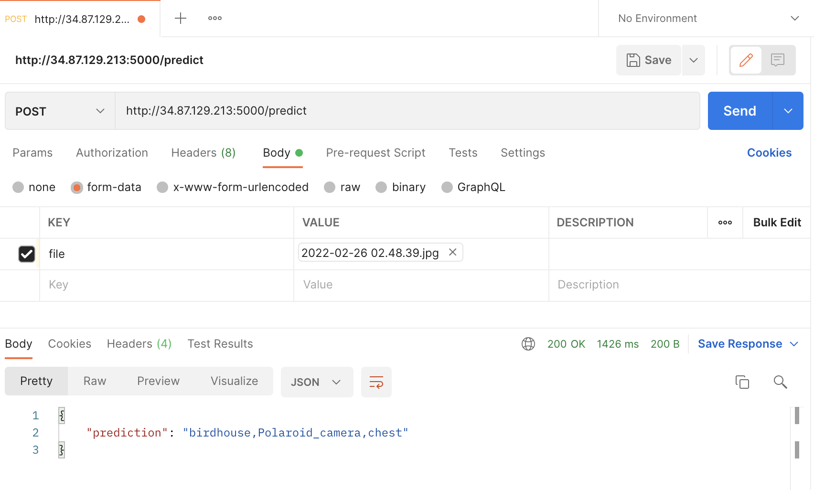

# IOT project

This repo includes the app (client) and the server that is hosted on google cloud. <br/>

This app is able to take photo and give a prediction of what the object is. <br/>

## Usage
Download iot.apk and install in android device.

## Client
Develop in android studio

## Server
This is a flask backend server

### Deploy on cloud

http://34.87.129.213:5000/

#### To send POST request to server
RequestParam: predict/file=image.jpg

Example:


Guide to deploy on cloud: https://www.section.io/engineering-education/deploy-flask-to-gce/ (remember to configure firewall)

### To run locally

```bash
python3 server.py
```
OR
```bash
export FLASK_APP="server.py"
flask run -p 5000
```

Localhost: http://0.0.0.0:5000/

### Depencies
pillow <br/>
flask <br/>
tensorflow (note: for mac m1 chip, have to create virtual env) <br/>

## References
https://cloud.google.com/compute/docs/quickstart-linux
https://loopj.com/android-async-http/
https://github.com/android-async-http/android-async-http
https://developer.android.com/training/camera/photobasics
https://educative.io/edpresso/extracting-an-apk-file-from-android-studio
https://stackoverflow.com/questions/45046001/how-to-configure-action-image-capture-to-store-the-photo-in-public-external-stor
https://stackoverflow.com/questions/29339565/how-do-i-call-rest-api-from-an-android-app
https://towardsdatascience.com/how-to-build-a-machine-learning-api-using-flask-2fb345518801